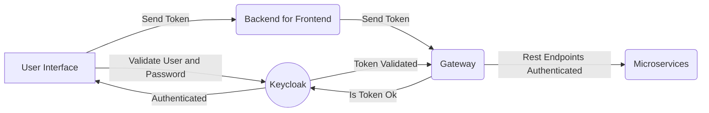

# Tariff Comparison

This project calcule Tariffs over multiples products, beyond upload files to batch processing.
# How to Run Locally
##  Pre Requisites
* docker: [Install Docker CLI](https://docs.docker.com/get-docker/)
* docker-compose: [Install Docker Compose](https://docs.docker.com/compose/install/)

## Getting Started

- Clone repository:
```sh
$ git clone ...
```

- Change Directory:
```sh
$ cd architecture/
```
- Start Script:
```sh
$ ./start.sh
```
Obs:
Maybe will be necessary give permissions to current user to run start script.
```sh
$ chmod +x ./start.sh
```
# Tecnologies
#### Architecture
- Kubernetes
- Docker
- Rancher
- Amazon Web Services
- NGINX
- Terraform
#### Microservice
- NodeJS
- Javascript
- Express
- Mongo DB
- Amazon AWS
#### Gateway
- NodeJS
- Keycloak
- JWT Security
- Roles
- Authorization / Authentication
- Routes
- Microservices
#### Backend for Frontend
- NodeJS
- Express Gateway
- TypeScript
- Apollo Server
- Graphql
#### Frontend
- NodeJs
- React JS
- Bootstrap
- Apollo Client
- Graphql
- Keycloak
- Authentication
## Overview

Quick architecture overview.

