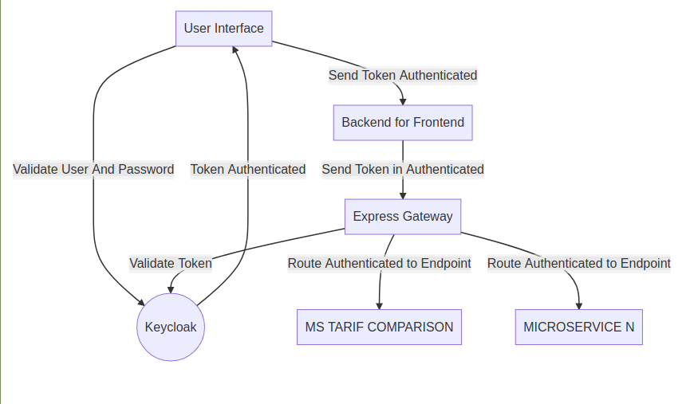

# Tariff Comparison

This project calcule Tariffs over multiples products, beyond upload files to batch processing.
# How to Run Locally
## Pre Requisites

* docker: [Install Docker CLI](https://docs.docker.com/get-docker/)
* docker-compose: [Install Docker Compose](https://docs.docker.com/compose/install/)
 
## Getting Started

1. Clone repository:
```sh
$ git clone https://github.com/Soares-Victor/tariff-comparasion.git
```
2. Change Directory:
```sh
$ cd tariff-comparasion/architecture/
```
3. Start Script:
```sh
$ ./start.sh
```
4. Open in your preffered browser: [User Interface](http://localhost:8000/ui-common)
```
Username: user
Password: user
```
Obs: 
* Maybe will be necessary give permissions to current user to run ./start.sh.
```sh
$ chmod +x ./start.sh
```
* If you get some error to run, check if the following port are already in use: 
  [3000, 4000, 8000, 8080, 7070, 27017, 4566]
# Documentation
- [Presentation](architecture/doc/Arch-Consolidation.ppt)
- [Collection Postman](architecture/collection/TariffComparison.postman_collection.json)

# Tecnologies
#### Architecture
- Kubernetes
- Docker
- Rancher
- Amazon Web Services
- NGINX
- Terraform
#### Microservice
- NodeJS
- Javascript
- Express
- Mongo DB
- Amazon AWS
#### Gateway
- NodeJS
- Keycloak
- JWT Security
- Roles
- Authorization / Authentication
- Routes
- Microservices
#### Backend for Frontend
- NodeJS
- Express Gateway
- TypeScript
- Apollo Server
- Graphql
#### Frontend
- NodeJs
- React JS
- Bootstrap
- Apollo Client
- Graphql
- Keycloak
- Authentication
## Overview
Quick architecture overview.

